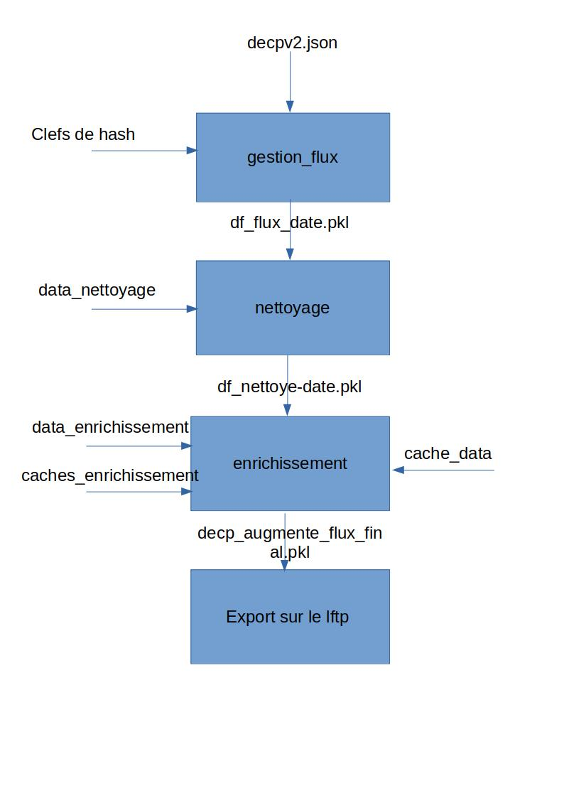

# PROJET DECP - Données Essentielles de la Commande Publique

## Description

## Les éléments nécessaires 
### Version
Pour l'instant (24/01/2023) le script est fonctionnel uniquement sur <b>Python 3.7</b>.  <brQ>
C'est sous ce format de Python que tourne les pipelines saagie.

### Les librairies Python utilisées

Sont renseignées dans le fichier **requirements.txt**

### Données
#### Format des données
Cette version de augmenté est relié à la sortie de decp-rama-V2

#### JSON
Le fichier des DECP utilisés dans ce projet est en format <b>JSON</b>, il se nomme : 'decp.json'. Ce fichier est mis à jour régulièrement sur le site de data.gouv : 
https://www.data.gouv.fr/fr/datasets/fichiers-consolides-des-donnees-essentielles-de-la-commande-publique/
Cependant, dans cette version de la pipeline on va le chercher sur le **S3** sous le nom de "decpv2.json"

#### CSV
Plusieurs données sous format csv - xlsx sont nécessaires afin d'enrichir les données :
- code-insee-postaux-geoflar.csv : https://public.opendatasoft.com/explore/dataset/code-insee-postaux-geoflar/export/?flg=fr
- cpv_2008_ver_2013.xlsx : https://simap.ted.europa.eu/fr/web/simap/cpv
- StockEtablissement_utf8.csv : https://www.data.gouv.fr/fr/datasets/base-sirene-des-entreprises-et-de-leurs-etablissements-siren-siret/
- StockUniteLegale_utf8.csv : https://www.data.gouv.fr/fr/datasets/base-sirene-des-entreprises-et-de-leurs-etablissements-siren-siret/
- departement2020.csv : https://www.insee.fr/fr/information/4316069
- region2020.csv : https://www.insee.fr/fr/information/4316069

Ils sont également accessibles depuis le **S3**.

#### GEOJSON
Pour réaliser la représentation graphique des données, ségmentée par régions et départements, certaines donneés en geojson sont récupérées directement via leur URL.
- https://france-geojson.gregoiredavid.fr/repo/regions.geojson
- https://raw.githubusercontent.com/gregoiredavid/france-geojson/master/departements-avec-outre-mer.geojson

### Webdriver
Afin d'optimiser l'enrichissement via le code siret/siren, une partie des données sont récupérées via une méthode de scraping sur le site infogreffe.fr. Pour une partie du code, le fichier exécutable <b>geckodriver.exe</b> est obligatoire. 

denominationUniteLegale
## To Do
### Pour lancer en local
#### Sans S3
- Posséder tous les éléments cités ci-dessus, si vous souhaitez le lancer en local.
- Dans le fichier utils.py mettre la variable *USE_S3* à False
- S'assurer que les données sont dans les bons sous-chemins
- Dans le dossier confs, le fichier var_to_export correspond à toutes les variables dans le DataFrame decp avant export final. 
   - Mettre à 1 les colonnes que l'on souhaite exporter
   - 0 Sinon.
- Exécuter tout le code 

#### Avec le S3
- S'assurer que l'on se connecte au bon S3, pour ce faire il y a deux possibilités : 
    * Avoir les credentials comme variables d'environnements (nécessaire lorsqu'on veut faire tourner le script sur CircleCI et Saagie)
    * Avoir en local un fichier *saagie_cred.json* avec sous forme de JSON les clefs et valeurs nécessaires (voir entête du script *utils.py*)

## Fonctionnement général de la pipeline augmenté.
### En amont
En amont de cette pipeline les données sont traitées par decp-rama-v2 puis uploadés sur le S3 sous le nom de "decpv2.json".

### La pipeline

Schéma de principe de la pipeline.

:hammer: Tous les fichiers nécessaires (matérialisés par des flèches) transitent par le S3. :hammer:

## Etapes de la donnée 

### Gestion flux
Cette partie permet de gérer quelles données ont déjà été vus (donc analysées) et quelles sont les nouvelles données à traiter.

#### Clef de hash
Pour ce faire on utilise des clefs de hash. On calcule la clef de hash pour chaque ligne extraite de decpv2.json et on les compare à un historique des clefs de hash déjà mémorisées.
On ne laisse passer à travers df_flux.pkl que les données correspondant aux nouvelles clefs de hash.

On distingue les lignes avec et sans modifications, car elles ne contiennent pas les mêmes informations.

:rotating_light: :rotating_light: :rotating_light: Si la manière de gérer les clefs de hash est modifiée, pensez à réinitialiser sur le S3 les fichiers correspondant et le processus :rotating_light: :rotating_light: :rotating_light:

### Nettoyage 
Explication de l'ensemble du traitement réalisé pour la partie nettoyage des données. 

#### Travail sur les titulaires
Au sein des decp on distingue deux types de données: les marchés et les concessions. Nous avons donc fusionné les colonnes comportant des informations semblables.

- La colonne concessionnaire a fusionné avec la colonne <b>titulaire</b> 
- La colonne valeur globale a fusionné avec la colonne <b>montant</b>
- La colonne autoriteConcedante.id a fusionné avec la colonne <b>acheteur.id</b>
- La colonne autoriteConcedante.nom a fusionné avec la colonne <b>acheteur.nom</b>
- On ne conserve que les données ou un titulaire est renseigné.

#### Travail sur les montants
Dans un souci de conservation de l'information source, la colonne montant est renommée en <b>montantOriginal</b> et l'ensemble des opérations suivantes seront appliquées à la colonne <b>montantCalcule</b>.

- Les valeurs manquantes sont remplacées par `0`
- Les montants inférieurs à `200€` et supérieur à `999 999 999€` sont remis à `0`
- Les montants composés d'au moins 5 fois le même chiffre (hors 0) sont remis à `0`.
- Les floats sont arrondis à l'entier.

#### Travail sur des codes manquants
Ce qui est appelé code correspond aux variables d'identifications. On parle ici aussi bien de la viariable id (identifiant des lignes de la base), que id.Titulaires (identifiant des entreprises) ou encore code_CPV permettant l'identification des types de marchés. 

- Remplacement des valeurs manquantes de <b>id</b> par `0000000000000000` (la colonne id sera retravaillée un peu plus tard dans le processus de nettoyage)
- Rerait des caractères spéciaux présent dans <b>idTitulaires</b>. On obtient le numéro SIRET
- Récupération du NIC et stockage dans une colonne <b>nic</b>
- Création d'une colonne <b>CPV_min</b> composé des deux premiers chiffres du code CPV. Cela permet d'identifier le type de marché (Fournitures/Travaux/Services)

#### Travail sur les régions
Récupération des codes de départements des marchés. On en profite pour ajouter les libellés et la région. 

- Extraction du code département de la colonne <b>lieuExecution.code</b> et stocké dans <b>codeDepartementExecution</b>
- Ajout du libellé du département / code de la région / libellé de la région respectivement dans <b>libelleDepartementExecution</b>, <b>codeRegionExecution</b> et <b>libelleRegionExecution</b>

#### Travail sur les dates

- Récupération de l'année et du mois de notification du marché et stockage dans <b>anneeNotification</b> et <b>moisNotification</b>
- Remplacement par np.NaN des dates lorsque l'année est inférieure à 1980 et supérieur à 2100 ou lorsque le format n'est pas standard.

#### Travail sur la durée du marché
Au sein des DECP les durées de marché sont exprimées en mois. De même que pour les montants, on conserve les durées initiales et on modifie les durées dans la colonne <b>dureeMoisCalculee</b>. De plus, on ajoute la colonne <b>dureeMoisEstimee</b>: Booléenne, la durée est-elle estimée ?  
Les durées corrigées sont celles :
- manquantes: corrigées à 0  

Tous les cas suivants seront corrigés en divisant par 30 (conversion en mois)
- durée égale au montant 
- montant / durée < <b>100</b>
- montant / durée < <b>1000</b> pour une durée > <b>12</b> mois
- duréee == <b>30</b> ou <b>31</b> et montant < <b>200 000</b> €
- duréee == <b>360</b> ou <b>365</b> ou <b>366</b> et montant < <b>10 000 000</b> €
- durée > <b>120</b> et montant < <b>2 000 000</b> €

Un début de travail sur de l'imputation a aussi été réalisé. On se place dans le cas des marchés qui ne sont pas des travaux (CPV_min != 45) et qui ont une duréeCalculee supérieure à 120.  
    - Imputation par la médiane des durées de mois pour un <b>CPV_min</b> équivalent.

#### Travail sur la variable qualitative objet. 
Remplacement du caractère `�` par `XXXXX` dans la colonne objet

#### Gestion des doublons.
[ ] En attente des règles côté métiers.

### Enrichissement des données

La partie enrichissement des données va nous permettre d'ajouter, grâce à des sources externes, de la donnée dans nos DECP. Pour cela nous utiliserons les sources de données suivantes:
   - INSEE
       - Code des régions, départements, arrondissements, cantons.
       - La base SIREN 
   - OpenDatasoft
       - Géolocalisations des communes
   - SIMAP (Système d'Information pour les MArchés Publics)
       - Nomencalture européenne des codes CPV

#### Enrichissement titulaire
- Chaque marché à au minimum un titulaire qui s'indenfie par un code identifiant, un id (siren) et une dénomination.
- Les cotitulaires, limités au nombre de 3, sont identifiables par les même informations. Mais sont facultatif.
- Le champ denominationUniteLegale des titulaires est le nom associé au SIREN dans la base de données siren.
- La même règle s'applique aux acheteurs, qui eux sont uniques pour chaque marché.

#### Enrichissement géographiques
Permis par les bases de données INSEE + OpenDataSoft

#### Gestion des caches d'enrichissement
##### Caches externes
Comme vu sur le schéma de principe on charge, en plus des bases de données décrit ci-haut, depuis le S3 ce que j'ai appelé caches_enrichissement.
Il s'agit de 6 caches, qu'on peut trouver sur le S3 avec le prefix cache/cache_ :

    - cache/cache_NOTIN_StockEtablissement_utf8.csv
    - cache/cache_NOTIN_StockUniteLegale_utf8.csv
    - cache/cache_StockEtablissement_utf8.csv
    - cache/cache_StockUniteLegale_utf8.csv
    - cache/cache_acheteur_NOTIN_StockUniteLegale_utf8.csv
    - cache/cache_acheteur_StockUniteLegale_utf8.csv

Ces caches stockent les informations trouvées dans les BDD externes, lors des runs précédents, pour ne plus avoir à les parcourir en entier à chaque fois. 
Chaque cache est dédoublé. Le cache classique (correspondant aux lignes d'enrichissement trouvées) et le cache NOTIN (correspondant à celles non trouvées).
On a un cache pour enrichir les titulaires d'un point de vue StockEtablissement (et son NOTIN), d'un point de vue StockUniteLegale.
Mais également un cache pour les acheteurs d'un point de vue StockUniteLegale.

:paw_prints: Les cachent finissent par ".csv" mais ce sont des objets pickle.
##### Cache interne
On aperçoit également un dernier cache data/cache_df, il s'agit du cache correspondant aux lignes déjà enrichies lors des runs précédents et mises en mémoires.
On concatène ces infos dans la fonction *concat_unduplicate_and_caching_hash*
Ce cache contient toutes les features que l'on a pu ajouter lors du processus.

#### Choix des données exportées
Peu de colonnes sont finalement exportées à travers dataeco, la fonction qui gère les colonnes à exporter est *manage_column_final* qui prend comme référence *var_to_export.json* 
pour savoir quelles colonnes exporter.

### Autre scripts
#### upload_dataeco.py
Fin de la chaine, après enrichissement le script permet de mettre sur le serveur dataeco le résultat des pipelines.
Ainsi, le fichier uploadé via lftp est visible à l'adresse data eco souhaitée.
#### upade_jobs_for_new_files.py
Permet d'upload les fichiers sur Saagie pendant la CD. Upload les fichiers modifiés depuis le dernier commit enregistré dans id_commit.txt sur le S3.
#### backup.py
Sauve le cache tous les x jours (variable x sur Saagie)
#### delete_old_files.py
Supprime les vieux fichiers présents sur le S3
#### utils.py
Gère tout ce qui est lié au S3.

## Comment fonctionne la CICD sur ce projet ?

La branche utilisée actuellement pour la CICD est :

:last_quarter_moon_with_face: cicd_saagie_pytest. :first_quarter_moon_with_face:

### CI
Lorsqu'on push le code sur Github, on effectue via un workflow CircleCI des tests de non régression (via le job pytest).
Puis, on exécute tout le code sur un échantillon fixe du dataset.

### CD (Saagie)
Une fois les tests passés on upload les jobs Saagie via le job "update_file" qui met à job les jobs présent sur Saagie. 
Le fichier python utile est *upade_jobs_for_new_files.py*, il est assez explicite.  
Côté Saagie le script à l'intérieur des jobs (et donc de la pipeline) est alors modifié et sera éxécuté à l'heure prévue sur la plateforme.

### Buckets
Il y a deux Buckets (S3) : l'un pour tout ce que l'on va stocker pour la prod.
Et un autre spécifique aux tests et la CI.
:guardsman: Avant de modifier des fichiers sur le S3, être sûr que l'on pointe vers le Bucket désiré.

### Quelques remarques
- Si la CI crash pour une erreur lié au S3 il se peut que ce soit simplement une erreur réseau ou que le S3 ou la ressource souhaitée sont indisponibles momentanément.
- Les tests d'enrichissement dépendent, entre autres, des caches présents dans le bucket test. Si vous modifiez ces derniers, considérez l'influence que cela a sur les tests.
- Si vous effectuez des modifications sur la gestion des données et que vous souhaitez que ces modifications s'appliquent à toutes les données, même celles déjà traitées il faudra alors au minimum supprimer du S3 les objets au prefix "data/hash_keys" (modifications et non modifications) ainsi que data/cache_df. Puis relancer la pipeline sur Saagie, la pipeline est ainsi "ré-initialisée" et tournera sur toutes les données, avec les nouveaux traitements.   
Pour être sûr que vous avez bien tout ré-initialisé, allez dans les logs du job gestion_flux. Vous devez y trouver que la shape du dataframe déjà processé vaut (0,0) pour les lignes sans modifs et (0,0) également pour les lignes avec modifs.

### Réalisation d'un tableau de bord 
   :chart_with_upwards_trend: Un dashboard a été fait et est disponible [ici](https://datavision.economie.gouv.fr/decp/?view=France)
